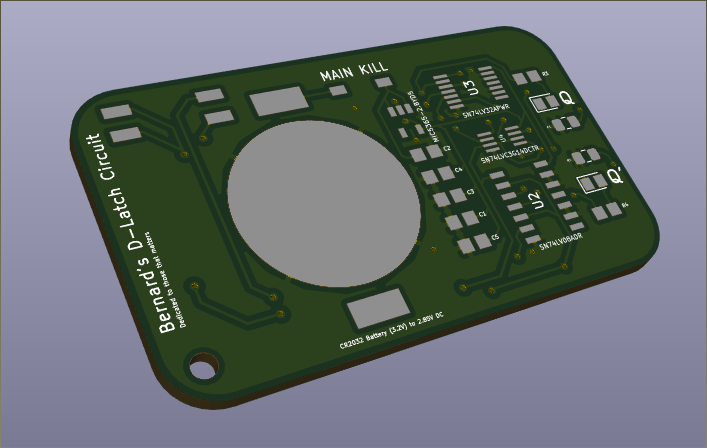

# 1-bit D-latch Keychain

> How it began?

This project was inspired by a dear friend of mine, Cheah Zi Ting, for her motivation in my pursuit for an Electrical Engineering degree.

This is also my very first Surface Mount Assembly. Special thanks to Daniel Rogge and Samuel Hansen for the guidance in assembling this keychain.

The assembled keychain was given to people of special means to me, including:
- Cheah Zi Ting
- Aston U
- Ferlina Hong
- Fairine Lai
- Reshmika Nair

This PCB is designed in KiCad Version 5.0.2.

---

## Table of Contents

- [Components](#components)
- [Assembly](#assembly)
- [Feature](#feature)
- [Import](#import)

---

## Components

Components were ordered from DigiKey:

- 4-CH 2-INPUT AND GATE 14SOIC (SN74LV08ADR)
- 4-CH 2-INPUT OR GATE 14TSSOP (SN74LV32PWR)
- 3-CH INVERTER SM8 (SN74LVC3G14DCTR)
- 2.5V Linear Regulator SC70-5 (MIC5365-2.5YC5-TR)
- 2 x SMD LED
- 20mm Coin Cell Holder
- 2 x 150Ohm Resistor 0805
- 5 x Ceramic Capacitor 1uF 0805
- Slide Dip Switch DPST
- Slide Dip Switch SPST

Printed Circuit Board is ordered from <a href="https://www.pcbway.com/" target="_blank">**Allpcb**</a>

Stencils for solder paste were ordered from <a href="https://www.oshstencils.com/#%20" target="_blank">**OSH Stencils**</a>

---

## Assembly

I will be explaining my steps very detailed here just in-case someone is new in putting together a PCB. If you are skilled at PCB Assembly, you can skip this part.

**Pasting**
- Secure the board to avoid it from moving around. I just taped my board down.
- Secure the stencil over the board, with the holes on the stencils and solder pads alligned.
- Apply some solder paste mixed with flux onto the card included in the stencil package.
- Wipe the solder paste over the stencil. Try to make one clean wipe rather than multiple one to reduce chances for shorts later on.

**Components**
- Place the components onto the board. The order really does not matter, but I started off with the IC chips. The dots will indicate the pin number and therefore the orientation.
- Place the resistors and capacitors onto the board. These capacitors and resistors are not polarized, so any direction is fine.
- Take note of the direction of the LED! You will DAMAGE your LED if you install it in reverse polarity. There is a green arrow at the bottom of the LED that point in the direction of the current. Be very sure that it is pointing TOWARDS the GND terminal.
- The battery holder and switches were installed onto the board

**Reflow**
- You can hot plate it, or even solder it yourself if you so choose to! But I chose to reflow my board.
- Depending on the heating profile of your solder paste which you can get datasheet off the internet, you want to set your temperature curve appropriately.

**Final touch-ups**
- Flux and surface tension is your friend here. If the paste application is good, there should be little to no shorts.
- It is always a good idea to put it under a microscope to look out for shorts, and use a soldering iron to get rid of the shorts.
- Wick off excess solder if there is any.
- Slide in the battery(a very tight fit, my mistake... ), and test if it works.
- I recommend finishing it off by wiping the PCB with rubbing alcohol to remove the flux, and using a sand paper to sand off the rough edges of the PCB.

---

## Feature

- MAIN_KILL is flipped to ON position to close the entire circuitry
- CLOCK and DATA are flipped depending on user's preference.
- Q and Q' are the corresponding output of the D-latch.
- It has a keychain hole to have a key-ring hooked onto it, that if you like to carry a d-latch circuit around with you ;)

---

## Import

1. Download the zip file.
2. Open KiCad, on the menu bar, there is an open-box with a "zip" label on it, click on that and locate the zip file.
3. If the schematic is showing boxes with "??", in Eeschema, go to Preferences -> Manage Symbol Library -> Browse Libraries and locate the Booster.lib and Gates.lib
4. Feel free to toy around, and edit it and mess around. You can always come back to download it if you mess up.

---
